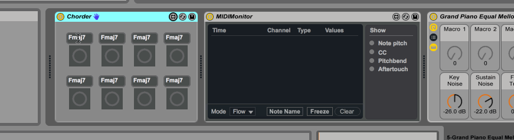

# max-chorder
**max-chorder** is a Max for Live intrument that lets users configure a grid of
chords using shorthand chord symbol notation, clicks on each grid item makes the
whole chord be played.

This allows musicians without MIDI Keyboards or the technique for using them to
perform a varied set of chords after a very light set-up phase.

## TODOs
- [ ] Clean-up
- [ ] Chord should stay pressed while the button is pressed
- [ ] Accept MIDI input like a Drum rack
- [ ] It seems messages are sent twice

## License
**max-chorder** bundled JavaScript, TypeScript source and Max Patch are
available under the GPLv3 license.
